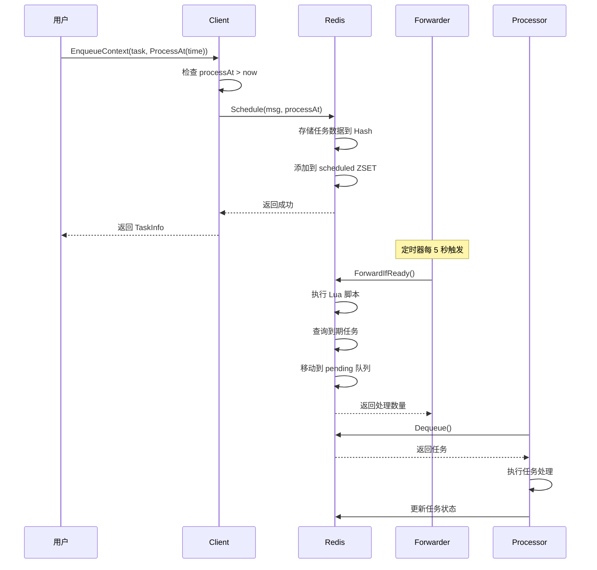
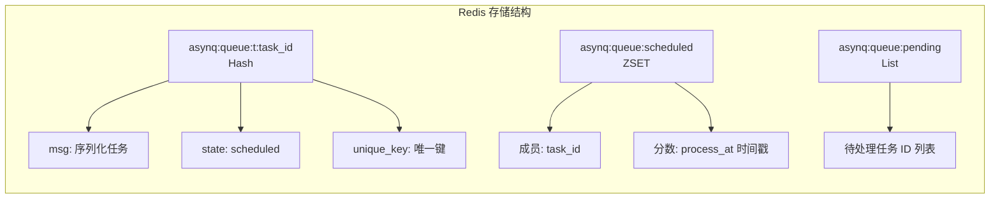
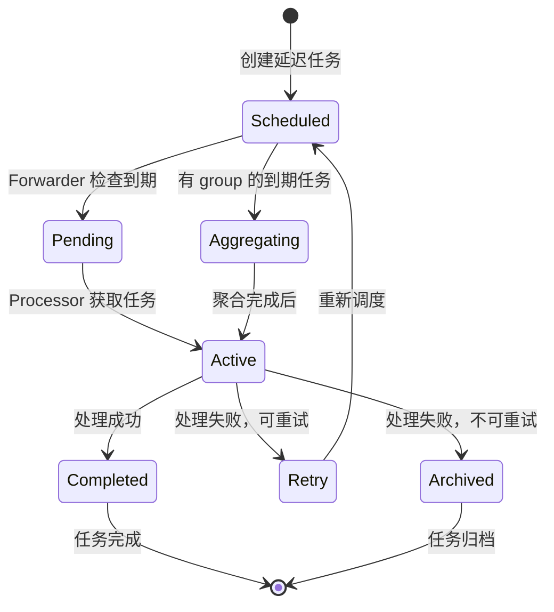
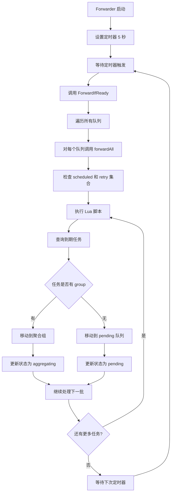
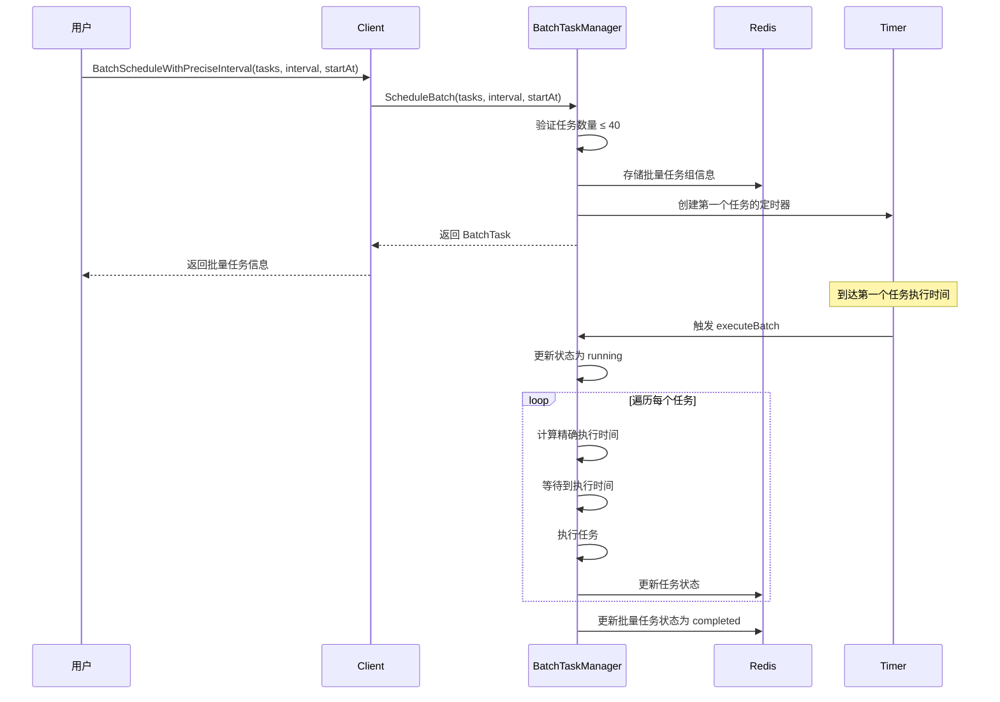
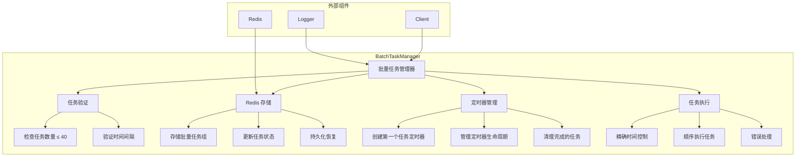
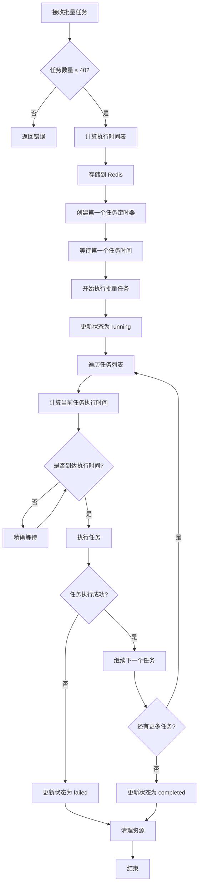
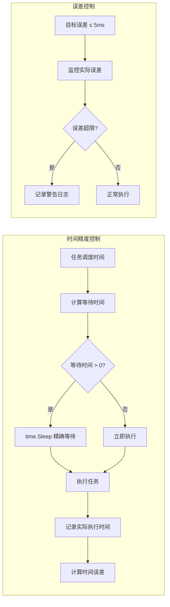
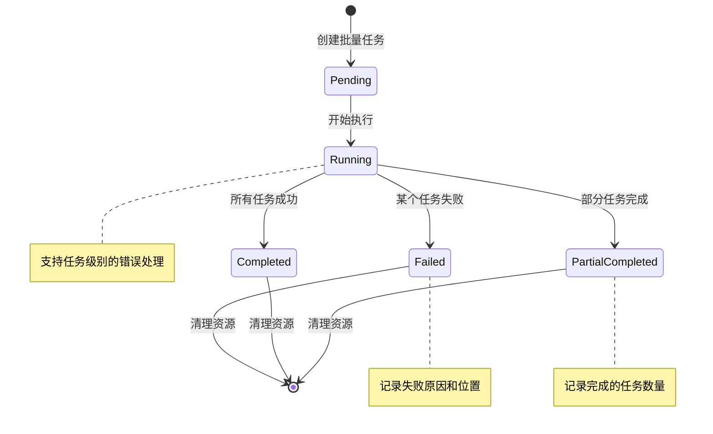
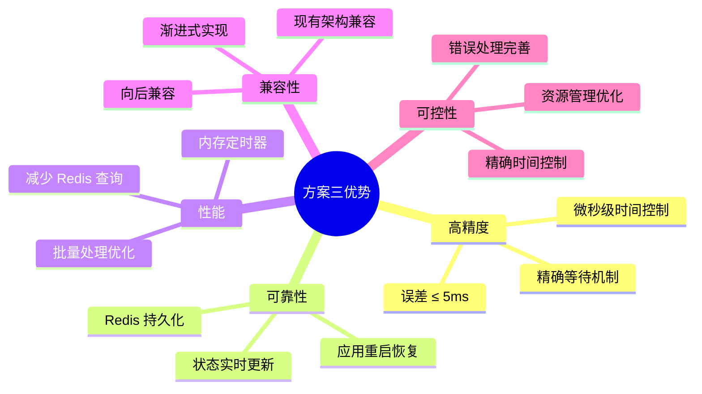

# Asynq 延迟消息实现流程图

## 1. 现有延迟消息实现流程

### 1.1 延迟任务创建流程



### 1.2 Redis 数据结构



### 1.3 任务状态流转



### 1.4 Forwarder 详细流程



## 2. 批量延迟任务设计方案

### 2.1 推荐方案：基于内存定时器的混合方案



### 2.2 批量任务管理器架构



### 2.3 批量任务执行流程



### 2.4 时间精度控制机制



### 2.5 错误处理和恢复机制



## 3. 实现对比

### 3.1 方案对比表

| 特性 | 现有延迟机制 | 方案一：批量调度 | 方案二：Redis Stream | 方案三：内存定时器 |
|------|-------------|-----------------|---------------------|-------------------|
| 时间精度 | 5秒检查间隔 | 100ms检查间隔 | 微秒级 | 微秒级 |
| 批量支持 | 不支持 | 支持 | 支持 | 支持 |
| 实现复杂度 | 简单 | 中等 | 复杂 | 中等 |
| 性能 | 中等 | 中等 | 高 | 高 |
| 可靠性 | 高 | 高 | 中等 | 高 |
| 资源消耗 | 低 | 中等 | 高 | 中等 |

### 3.2 推荐方案优势



## 4. 使用示例

### 4.1 基本使用

```go
// 创建批量任务
tasks := []*asynq.Task{
    asynq.NewTask("send_email", []byte("user1@example.com")),
    asynq.NewTask("send_email", []byte("user2@example.com")),
    asynq.NewTask("send_email", []byte("user3@example.com")),
    // ... 最多40个任务
}

// 批量调度，每个任务间隔100ms
batch, err := client.BatchScheduleWithPreciseInterval(
    context.Background(),
    tasks,
    100*time.Millisecond,
    time.Now().Add(1*time.Second), // 1秒后开始
)
```

### 4.2 配置选项

```go
// 自定义配置
config := &BatchTaskConfig{
    MaxBatchSize:     40,
    DefaultInterval:  100 * time.Millisecond,
    MaxTimeError:     5 * time.Millisecond,
    RetryOnFailure:   true,
    MaxRetries:       3,
}

client := asynq.NewClient(redisOpt, asynq.WithBatchConfig(config))
```

这个设计方案能够满足您的需求：批量提交最多40个任务，每个任务间隔100ms（可配置），时间误差控制在5ms以内，同时保持与现有Asynq架构的兼容性。
