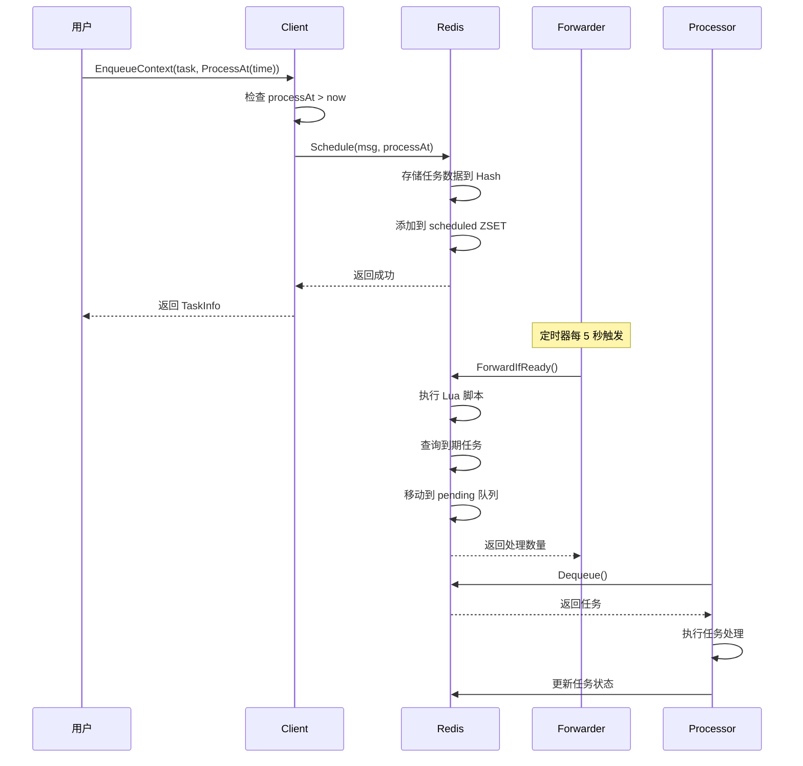
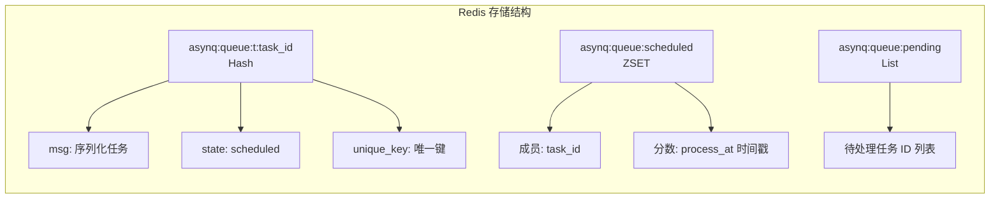
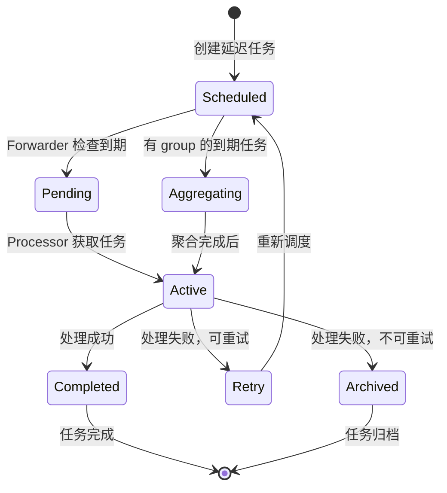
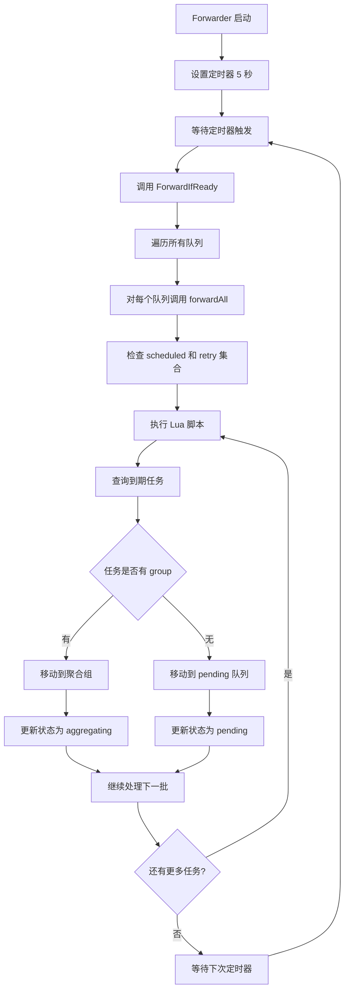
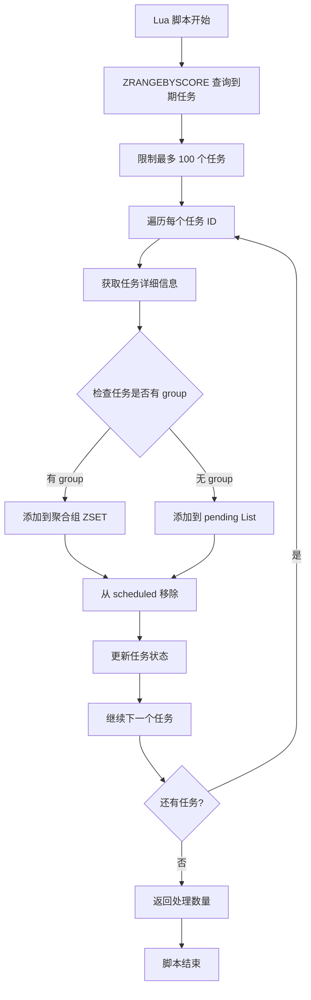

# Asynq 延迟消息实现分析

## 概述

Asynq 框架的延迟消息实现基于 Redis 的有序集合（ZSET）和定时轮询机制。延迟消息通过以下核心组件实现：

1. **Client** - 负责创建和调度延迟任务
2. **Forwarder** - 负责将到期的延迟任务从 scheduled 状态转移到 pending 状态
3. **Redis 存储** - 使用 ZSET 存储延迟任务，以时间戳作为分数
4. **Processor** - 负责处理 pending 状态的任务

## 核心组件分析

### 1. 延迟任务创建

当用户使用 `ProcessAt()` 或 `ProcessIn()` 选项创建任务时：

```go
// 在 client.go 的 EnqueueContext 方法中
if opt.processAt.After(now) {
    err = c.schedule(ctx, msg, opt.processAt, opt.uniqueTTL)
    state = base.TaskStateScheduled
}
```

### 2. Redis 存储结构

延迟任务在 Redis 中的存储结构：

- **任务数据**: `asynq:{queue}:t:{task_id}` (Hash)
  - `msg`: 序列化的任务消息
  - `state`: "scheduled"
  - `unique_key`: 唯一键（如果设置了唯一性）

- **调度集合**: `asynq:{queue}:scheduled` (ZSET)
  - 成员: task_id
  - 分数: process_at 时间戳（Unix 时间）

### 3. Forwarder 机制

Forwarder 是一个后台 goroutine，定期检查到期的延迟任务：

```go
// forwarder.go
func (f *forwarder) exec() {
    if err := f.broker.ForwardIfReady(f.queues...); err != nil {
        f.logger.Errorf("Failed to forward scheduled tasks: %v", err)
    }
}
```

### 4. 任务转发逻辑

Forwarder 使用 Lua 脚本批量处理到期任务：

```lua
-- forwardCmd 脚本
local ids = redis.call("ZRANGEBYSCORE", KEYS[1], "-inf", ARGV[1], "LIMIT", 0, 100)
for _, id in ipairs(ids) do
    local taskKey = ARGV[2] .. id
    local group = redis.call("HGET", taskKey, "group")
    if group and group ~= '' then
        -- 移动到聚合组
        redis.call("ZADD", ARGV[4] .. group, ARGV[1], id)
        redis.call("ZREM", KEYS[1], id)
        redis.call("HSET", taskKey, "state", "aggregating")
    else
        -- 移动到待处理队列
        redis.call("LPUSH", KEYS[2], id)
        redis.call("ZREM", KEYS[1], id)
        redis.call("HSET", taskKey, "state", "pending", "pending_since", ARGV[3])
    end
end
```

## 任务状态流转

1. **Scheduled** → **Pending**: 通过 Forwarder 定时检查
2. **Pending** → **Active**: 通过 Processor 获取任务
3. **Active** → **Completed/Retry/Archived**: 根据处理结果

## 流程图

### 1. 延迟任务创建流程



### 2. Redis 数据结构



### 3. 任务状态流转



### 4. Forwarder 详细流程



### 5. Lua 脚本执行逻辑



## 关键特性

### 1. 批量处理
- 每次最多处理 100 个到期任务，避免长时间阻塞
- 使用 Lua 脚本保证原子性操作

### 2. 定时轮询
- 默认每 5 秒检查一次到期任务
- 可通过 `DelayedTaskCheckInterval` 配置

### 3. 状态管理
- 任务状态存储在 Redis Hash 中
- 支持 scheduled、pending、active、completed 等状态

### 4. 唯一性支持
- 支持任务的唯一性约束
- 使用 Redis SET 命令的 NX 选项实现

### 5. 聚合支持
- 支持任务聚合功能
- 相同 group 的任务会被聚合处理

## 性能优化

1. **批量操作**: 使用 Lua 脚本批量处理任务
2. **索引优化**: 使用 ZSET 的时间戳索引快速查询
3. **内存管理**: 及时清理已完成的任务数据
4. **并发控制**: 使用 Redis 的原子操作保证一致性

## 总结

Asynq 的延迟消息实现是一个高效、可靠的解决方案，通过 Redis 的有序集合和定时轮询机制，实现了精确的延迟任务调度。其设计考虑了性能、可靠性和扩展性，是一个成熟的分布式任务队列实现。
